# Projeto Conceitual - Oficina Mecânica

## Descrição do Projeto

Este projeto apresenta o esquema conceitual de um sistema de controle e gerenciamento de execução de ordens de serviço em uma oficina mecânica.

A proposta foi desenvolvida a partir da narrativa fornecida no desafio, com o objetivo de representar as principais entidades do sistema, seus atributos e os relacionamentos existentes entre elas.

O sistema considera o processo em que clientes levam veículos à oficina para consertos ou revisões periódicas. Cada veículo é encaminhado para uma equipe de mecânicos, que avalia os serviços necessários, registra uma ordem de serviço e realiza a execução após a autorização do cliente.

---

## Objetivo

Criar um esquema conceitual para o contexto de uma oficina mecânica, representando de forma adequada:

* os clientes e seus veículos;
* as equipes de mecânicos;
* as ordens de serviço;
* os serviços executados;
* as peças utilizadas;
* a composição do valor total da OS.

---

## Narrativa do Problema

Sistema de controle e gerenciamento de execução de ordens de serviço em uma oficina mecânica.

Clientes levam veículos à oficina mecânica para serem consertados ou para passarem por revisões periódicas.

Cada veículo é designado a uma equipe de mecânicos que identifica os serviços a serem executados e preenche uma OS com data de entrega.

A partir da OS, calcula-se o valor de cada serviço, consultando-se uma tabela de referência de mão de obra.

O valor de cada peça também irá compor a OS.

O cliente autoriza a execução dos serviços.

A mesma equipe avalia e executa os serviços.

Os mecânicos possuem código, nome, endereço e especialidade.

Cada OS possui: número, data de emissão, valor, status e uma data para conclusão dos trabalhos.

---

## Diagrama Conceitual em Mermaid

```mermaid
erDiagram

    CLIENTE {
        int id_cliente PK
        string nome
        string telefone
        string endereco
    }

    VEICULO {
        int id_veiculo PK
        string placa
        string modelo
        string marca
        int ano
        string cor
        int id_cliente FK
    }

    EQUIPE {
        int id_equipe PK
        string nome_equipe
    }

    MECANICO {
        int cod_mecanico PK
        string nome
        string endereco
        string especialidade
        int id_equipe FK
    }

    ORDEM_SERVICO {
        int num_os PK
        date data_emissao
        decimal valor_total
        string status
        date data_conclusao
        date data_entrega_prevista
        boolean autorizacao_cliente
        int id_veiculo FK
        int id_equipe FK
    }

    SERVICO {
        int id_servico PK
        string descricao
        decimal valor_mao_obra
        int id_tabela_ref FK
    }

    TABELA_REFERENCIA {
        int id_tabela_ref PK
        string descricao
        decimal valor_referencia
    }

    PECA {
        int id_peca PK
        string descricao
        decimal valor_unitario
    }

    ITEM_SERVICO {
        int id_item_servico PK
        int num_os FK
        int id_servico FK
        int quantidade
        decimal valor_servico_aplicado
        decimal subtotal_servico
    }

    ITEM_PECA {
        int id_item_peca PK
        int num_os FK
        int id_peca FK
        int quantidade
        decimal valor_unitario_aplicado
        decimal subtotal_peca
    }

    CLIENTE ||--o{ VEICULO : possui
    VEICULO ||--o{ ORDEM_SERVICO : gera
    EQUIPE ||--o{ MECANICO : composta_por
    EQUIPE ||--o{ ORDEM_SERVICO : responsavel_por
    ORDEM_SERVICO ||--o{ ITEM_SERVICO : contem
    SERVICO ||--o{ ITEM_SERVICO : compoe
    ORDEM_SERVICO ||--o{ ITEM_PECA : utiliza
    PECA ||--o{ ITEM_PECA : compoe
    TABELA_REFERENCIA ||--o{ SERVICO : referencia
```

---

## Explicação do Modelo Conceitual

O modelo foi construído para representar de forma organizada o funcionamento de uma oficina mecânica no controle das ordens de serviço.

A entidade **CLIENTE** representa a pessoa responsável por levar o veículo à oficina. Cada cliente pode possuir um ou mais veículos.

A entidade **VEICULO** representa o automóvel que será atendido pela oficina. Cada veículo pertence a um único cliente, mas pode gerar várias ordens de serviço ao longo do tempo, já que um mesmo veículo pode passar por diferentes manutenções ou revisões.

A entidade **EQUIPE** representa o grupo de mecânicos responsável pela análise e execução da ordem de serviço. A narrativa informa que a mesma equipe que avalia os serviços também os executa, por isso a OS está diretamente relacionada à equipe.

A entidade **MECANICO** representa os profissionais da oficina. Cada mecânico possui código, nome, endereço e especialidade. No modelo adotado, cada mecânico pertence a uma equipe.

A entidade **ORDEM_SERVICO** é central no sistema. Ela registra os dados principais do atendimento, como número, data de emissão, valor total, status, data de conclusão, data prevista de entrega e autorização do cliente.

A entidade **SERVICO** representa os tipos de serviços que podem ser executados na oficina. O valor da mão de obra do serviço pode ser obtido com base em uma tabela de referência.

A entidade **TABELA_REFERENCIA** foi criada para representar a tabela de mão de obra mencionada na narrativa. Ela funciona como base de consulta para o valor dos serviços.

A entidade **PECA** representa as peças que podem ser utilizadas em uma ordem de serviço, compondo também o valor total da OS.

As entidades **ITEM_SERVICO** e **ITEM_PECA** foram criadas para resolver corretamente os relacionamentos muitos-para-muitos entre OS e serviços, e entre OS e peças. Isso permite registrar quantidade, valor aplicado e subtotal de cada item dentro da ordem de serviço.

---

## Entidades e Atributos

### CLIENTE

* id_cliente (PK)
* nome
* telefone
* endereco

### VEICULO

* id_veiculo (PK)
* placa
* modelo
* marca
* ano
* cor
* id_cliente (FK)

### EQUIPE

* id_equipe (PK)
* nome_equipe

### MECANICO

* cod_mecanico (PK)
* nome
* endereco
* especialidade
* id_equipe (FK)

### ORDEM_SERVICO

* num_os (PK)
* data_emissao
* valor_total
* status
* data_conclusao
* data_entrega_prevista
* autorizacao_cliente
* id_veiculo (FK)
* id_equipe (FK)

### SERVICO

* id_servico (PK)
* descricao
* valor_mao_obra
* id_tabela_ref (FK)

### TABELA_REFERENCIA

* id_tabela_ref (PK)
* descricao
* valor_referencia

### PECA

* id_peca (PK)
* descricao
* valor_unitario

### ITEM_SERVICO

* id_item_servico (PK)
* num_os (FK)
* id_servico (FK)
* quantidade
* valor_servico_aplicado
* subtotal_servico

### ITEM_PECA

* id_item_peca (PK)
* num_os (FK)
* id_peca (FK)
* quantidade
* valor_unitario_aplicado
* subtotal_peca

---

## Relacionamentos e Cardinalidades

### CLIENTE — VEICULO

Um cliente pode possuir vários veículos, mas cada veículo pertence a apenas um cliente.

**Cardinalidade:** 1:N

### VEICULO — ORDEM_SERVICO

Um veículo pode gerar várias ordens de serviço ao longo do tempo, mas cada ordem de serviço está vinculada a apenas um veículo.

**Cardinalidade:** 1:N

### EQUIPE — MECANICO

Uma equipe é composta por vários mecânicos, e cada mecânico pertence a uma equipe.

**Cardinalidade:** 1:N

### EQUIPE — ORDEM_SERVICO

Uma equipe pode ser responsável por várias ordens de serviço, mas cada OS é atribuída a apenas uma equipe.

**Cardinalidade:** 1:N

### ORDEM_SERVICO — ITEM_SERVICO

Uma ordem de serviço pode conter vários itens de serviço.

**Cardinalidade:** 1:N

### SERVICO — ITEM_SERVICO

Um serviço pode aparecer em vários itens de serviço, em diferentes ordens de serviço.

**Cardinalidade:** 1:N

### ORDEM_SERVICO — ITEM_PECA

Uma ordem de serviço pode utilizar várias peças.

**Cardinalidade:** 1:N

### PECA — ITEM_PECA

Uma peça pode aparecer em vários itens de peça, em diferentes ordens de serviço.

**Cardinalidade:** 1:N

### TABELA_REFERENCIA — SERVICO

Uma tabela de referência pode servir de base para vários serviços.

**Cardinalidade:** 1:N

---

## Regras de Negócio

1. Um cliente pode possuir vários veículos.
2. Cada veículo pertence a um único cliente.
3. Um veículo pode ter várias ordens de serviço ao longo do tempo.
4. Cada ordem de serviço é atribuída a uma única equipe.
5. A mesma equipe que avalia os serviços é a equipe que executa a OS.
6. Uma equipe é composta por mecânicos.
7. Cada mecânico possui código, nome, endereço e especialidade.
8. Uma ordem de serviço pode conter vários serviços.
9. Uma ordem de serviço pode utilizar várias peças.
10. O valor total da OS é composto pela soma dos serviços executados e das peças utilizadas.
11. O cliente deve autorizar a execução dos serviços.
12. O valor da mão de obra dos serviços é consultado em uma tabela de referência.
13. Cada OS possui número, data de emissão, valor, status e data para conclusão dos trabalhos.

---

## Decisões de Modelagem

Alguns pontos não estavam totalmente detalhados na narrativa. Por isso, foram adotadas as seguintes decisões de modelagem para tornar o esquema mais correto e completo:

* Foi criada a entidade **CLIENTE**, embora a narrativa não detalhe seus atributos, pois ela é indispensável para o contexto.
* Foi criada a entidade **VEICULO**, pois os veículos são elementos centrais no processo da oficina.
* Foram adicionadas as entidades associativas **ITEM_SERVICO** e **ITEM_PECA** para representar adequadamente os relacionamentos muitos-para-muitos.
* Foi incluída a entidade **TABELA_REFERENCIA** para refletir a consulta ao valor da mão de obra citada na narrativa.
* Foi adicionado o atributo **autorizacao_cliente** em **ORDEM_SERVICO**, para representar a necessidade de aprovação antes da execução.
* O atributo **valor_total** foi mantido em **ORDEM_SERVICO**, mesmo podendo ser calculado a partir dos itens de serviço e peça, porque a narrativa informa explicitamente que cada OS possui um valor.

---

## Justificativa da Modelagem

A modelagem proposta busca representar o cenário de forma mais correta possível dentro de um modelo conceitual.

A principal preocupação foi evitar simplificações inadequadas, especialmente na relação entre ordem de serviço, serviços e peças. Em vez de ligar OS diretamente a serviço e peça sem detalhamento, foram criadas entidades associativas para registrar corretamente quantidades, valores aplicados e subtotais.

Essa decisão torna o modelo mais consistente, mais próximo de uma aplicação real e tecnicamente mais adequado para avaliação acadêmica.

---

## Conclusão

O esquema conceitual desenvolvido representa de forma estruturada o funcionamento de uma oficina mecânica no controle de ordens de serviço. O modelo contempla clientes, veículos, equipes, mecânicos, serviços, peças e a composição dos custos da OS, seguindo a narrativa proposta e adotando decisões de modelagem coerentes quando necessário.

Esse modelo fornece uma base sólida para futuras etapas de transformação em modelo lógico e implementação em banco de dados.

---
